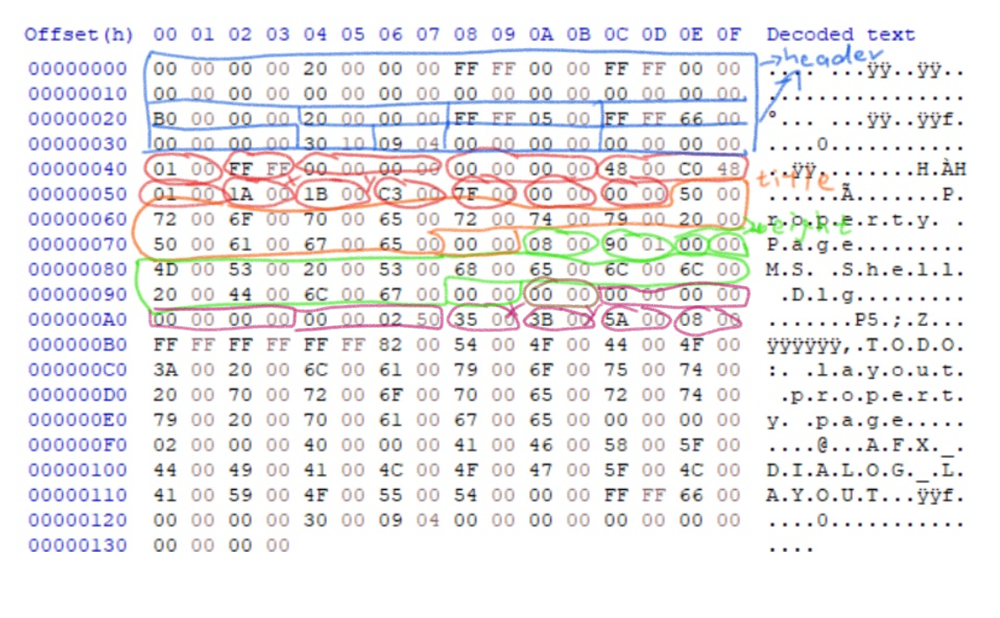

# Dialog Editor

## Project **dlg-create**

This is a test project for dialog resource interpretation.


The dump file is originated from the default dialog box resource by Visual Studio 2019. The blue region contains 2 resource headers (1 for whole file, 1 for the following dialog resource), each has 32 bytes. Red, Orange (title string), Green (typeface string) region combined is the dialog template data. Brown region is 2-byte padding, following Purple region shows few fields at the beginning of a dialog control item, more fields come afterwards.

### DWORD Alignment

All data structures are organized by aligning on DWORD (4-byte) boundary, both in file and in memory.

The size of data can be calculated by setting a dummy start address as `0x0`, which is DWORD (4-byte) aligned.

In order to load data into memory: allocate memory, then align pointer to the first DWORD boundary, and copy over the data.

Standard n-byte alignment is expressed as following:
```
aligned = ((addr + n - 1) / n) * n
```
where the division only keeps integer part.

For DWORD alignment, the division and multiplication can be optimized by left/right shift by 2:
```
aligned = ((addr + 3) >> 2) << 2
```

### WORD Alignment

All length-varying data (string, creation data) are encoded in UNICODE, and they are aligned on WORD boundary.

The first bit (LSB) is enough to determine the size of padding (0 or 1 byte):
```
aligned = addr + addr & 1
```

### Dialog Template

A dialog starts with a data structure `DLGTEMPLATE(EX)`, and `DLGTEMPLATEEX` is not well-defined because size of some fields are runtime-determined.

Followed after `DLGTEMPLATE(EX)`, are multiple `DLGITEMTEMPLATE(EX)` structures and each one of them are DWORD-aligned. `DLGITEMTEMPLATEEX` is not well-defined due to same reason above.

## Project **application-test**

This project tests critical UI functionalities
2020/06/06: This project has been archived as early-state trails, more progressive modification fall-through to following projects.

### Window Designer

The designer has a base pane, hence the main window; and another disabled child window, hence the target window.

Verification Required: Base pane should not have **WS_CLIPCHILDREN**.

## Project **size-handle-test**

2020/06/06: Target design window handle-drawing test.

### WM_PAINT

According to MSDN: **WM_PAINT** should be guarded by `BeginPaint` and `EndPaint` because they validate regions and pop WM_PAINT message out of the queue. Without calling them will result in concurrent paint request, and screen flikering, cpu racing, etc.

Considering state of WM_PAINT, there are three steps:

```c
case WM_PAINT:
{
    // pre-paint

    PAINTSTRUCT ps;
    HDC hdc = BeginPaint(hWnd, &ps);
    // in-paint
    EndPaint(hWnd, &ps);

    // post-paint
    hdc = GetDC(hWnd);
    // ...
    ReleaseDC(hWnd, hdc);
}
```

**Pre-paint** is just for additional set up, but interesting thing is: `InvalidateRect()` can be used without causing recurrence, this is not verified or proved to be very useful.

**In-paint** uses the legimate DC returned by `BeginPaint()` (also can be retrived from `ps`). This part of painting is only limitted to the invalid regions, not necessarily the entire client area, meaning double-buffering or clien-area-wise drawing process will not work here because the window will only only make updates inside invalid regions visible, other things will be clipped.

**Post-paint** can freely control other DCs and draw on them without limitations, and all modifications in this part will be preserved top-most on corresponding DC scale until next WM_PAINT comes. Since all paintings on screen are now finalized, so any further overlapping in this section will override anything it touches. i.e. `BitBlt` from memory needs to be delicate:

* **XOR** operation is often used if shape frames are to be drawn/updated. only one XOR is enough if preserving color is unnecessary, otherwise mask copy is required.
* If copying image, removing background color requires one additional **AND** to put a mask on destination, then XOR back.

This part can definitely implement in pre-paint, but in-paint might override those changes.
